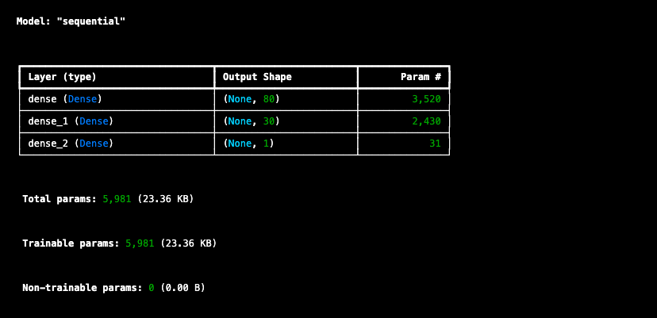
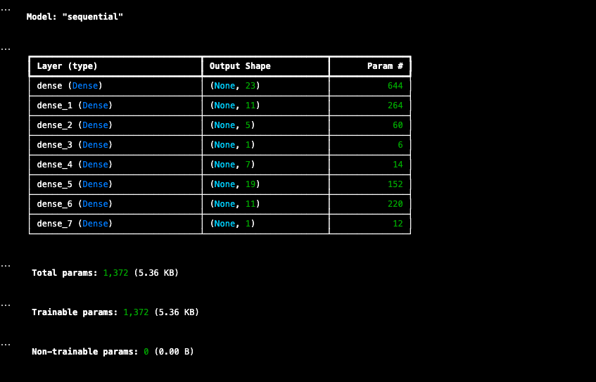

# Predicting Charity Funding Venture Success with Nueral Networks

## Overview:

The purpose of this analysis was to use sample data to train a nueral network in the hopes of creating a model that can predict a succsful venture to fund for a fictional non profit orginization. 

### Goal: 
Our goal is to come up with a model that will predict a successful venture with at least 75% accuracy

### The Data
charity_data.csv was used as our test data and to train our models. A local copy to this csv is not contained int he repo, but it was accessed remotely in both of the jupyter notebooks. This dataset contained more than 34,000 different ventures that have been funded by Alphabet Soup. It also contains 11 different dimensions for each venture that were preproccessed for our model. 

### The documents 
* AlahpabetSoupCharity_Analysis.ipynb contains our first attempt at creating such a model where the parameters for our nueral network were chosen manually
  ** AlhpabetSoupCharity.h5 contains the exported results of our model
* AlphabetSoupCharity_Optimization.ipynb contains our second attempt where we tried to optimize our model using some more machine learning techniques
  ** AlphabetSoupCharity_Optimization.h5 contains the exported results of our model 

## The PreProcessing
Before we tested either model we needed to preprocess our data. This included identifying the features we wanted to target, the measure to use, and the data we wanted to remove. 

### The Features
The features we decided to use for our model were the following 
* Ask_Amount (How much money each venture requested) a continuous variable
* Application_Type (Each application was classified into one of 17 different types) a discrete variable
* CLassification (Government orgainazation classsification 71 categories) a discrete variable
* Income_Amt (A classification of each ventures income. There were 8 different classifications) a discrete variable
* Special_Considerations (Whether or not the application had special considerations) a boolean variable
* Status (Whether a venture was active or completed) a boolean variable

### The Measure
The meseaure we decided to use to evaluate our model was 'Is_Successful' which is a boolean variable that keeps track of a ventures success

### Variables not Used
The following variables were not used in our models 
* EIN and Name (two seperate identification columns) float and string values respectiley
* Affiliation (The affiliated sector of industry with 6 types) a discrete variable
* Use_Case (The use case of the funding. 5 types) a discrete variable
* Orginization (The type of originization applying 4 types) a discrete variable

### A Breakdown of PreProccessing
The identification variables were dropped because they do not fit into our analysis. Now for the reason the other variables were excluded it was due to them being discrete variables, but not having many different types. We felt that they might not be as predictive as the other features. Now for the features we chose we weanted to get as much predictive power as possible with as little dimensionality this is why ask amount was so helpful as it was a continuous variable. As for the other non boolean variables we created some cutoffs to reduce the classes and therefore reduce the dimensionality of our test parameters. It was also our hope that this would help with balancing the weight of each of these categories. Finally we used getDummies to turn all the discrete categories into boolean models for model testing. Is_Successful was an obvious choice for our target measure.

## The Models

### Model 1:  2 layers, relu activation function, 100 epochs

### Anlaysis
This model performed pretty well with an accuracy rate of 72.8%. As this was a first attempt there wasn't that much motivation behind the specifics of the parameters of our model as it was only meant to be a starting point. The main objective was to create a starting point for optimizing our model 

### Model 2: 7 layers, relu activation function, 7 epochs

### Analysis:
After our first attempt our goal was to optimize our model and see if we could boost our performance. For that reason we decided to use kerastuner to identify the ideal parameters for our relu activation function. Since kerastuner can be computationally expensive we also had to adjust our features in order to reduce dimensionality and restrict our epoch limit to 20. (It still took 18 minutes to run) Given these parameters the best model that kerastuner was able to identify had an accuracy of 72.4%. 

## Conclusion
While we were unable to reach our ultimate goal of 75% accuracy we were still able to discover some interesting things. Our initial models accuracy of 72% suggests that the features we chose had a good correlation to a ventures success. However, as we saw in both models the feature matrix had a high dimension which made it a computationally expensive matrix to test our models with. Further as we weren't able to improve upon our accuracy with kerastuner it would appear that we have maximized our relu activation function as much as possible. For further analysis I believe that we should look further at the correlation of our variables through a correlation matrix, and test out other activation functions. 